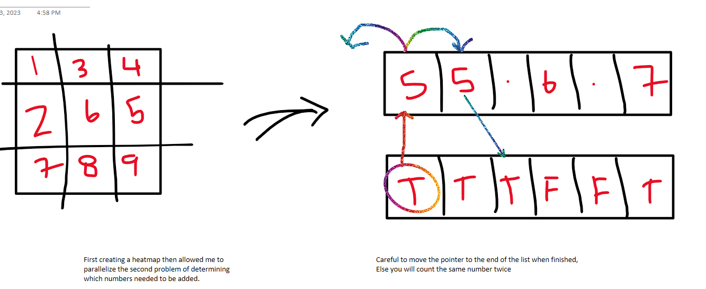

## notes

Matrices on day 3 seems brutal.

### Part 1

Here's a rough idea on part 1, the `idx = stop` was key to not double counting.

### Part 2 

This took me wayyyy to long, and ultimately I realized that there are no corner cases in the input.txt file so after commenting out all the if/else <> len code it passed....
