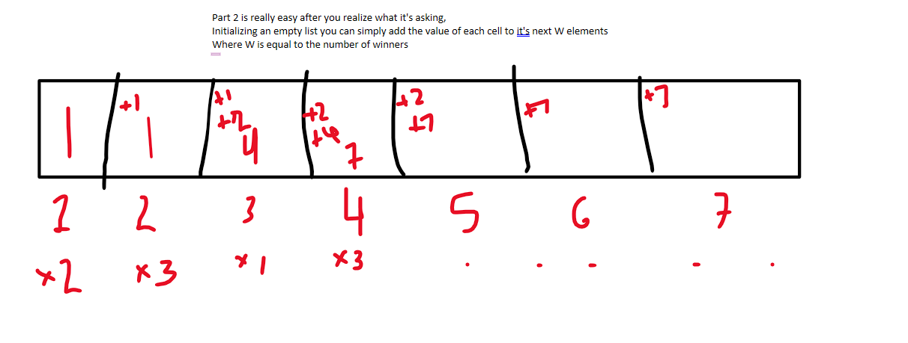

## Notes

### Part 1

This one was simple in theory: sum += how many times each pair of sets.  

That said i'm not familiar enough, and will look later if `set intersection()` is a stdlib feature.

### Part 2

This one actually took me less time than the first part.  My first thought in reading the question was this would be a recursive problem.  After realizing you simply needed to push the count forward W times it was pretty easy to implement with an empty list.

### Improvement

This is still `O(N^2)` time which i'd like improve on.  Set operations would be ideal.  Guess that's just a hashmap under the hood??

Further, with the goal of learning a new language, more the main body use of channels and/or goroutines in place of these single row computations (like part 1) would be a new area of exploration.
