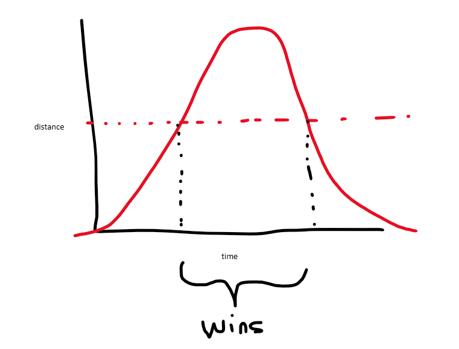

## Notes

### Part 1

The input was so small brute force took only a minute to write and execute.

However I knew this was a simple math problem so once I sat down and drew out the example case, I remembered something with parabolas:

Once you draw the curve, you need to find the two intersections with `y = <given distance>`.  That's the quadratic formula.  After solving though you need to find the distance between the two for all possible win scenarios.

### Part 2

No different, just a bigger number.
